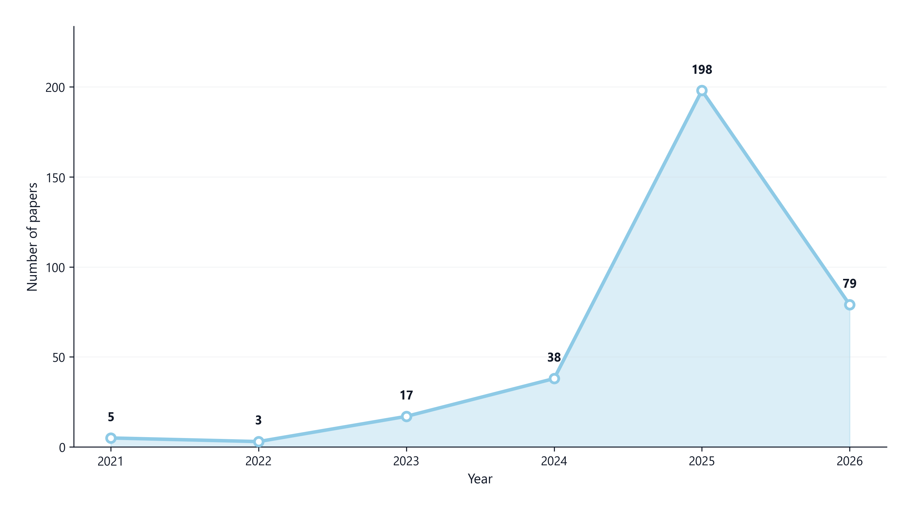
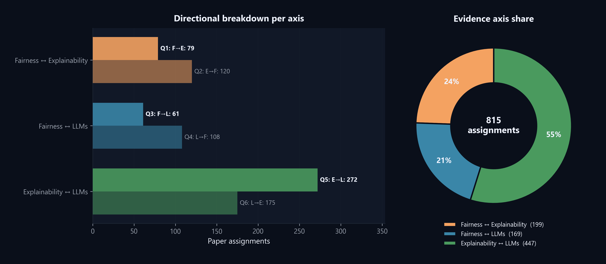
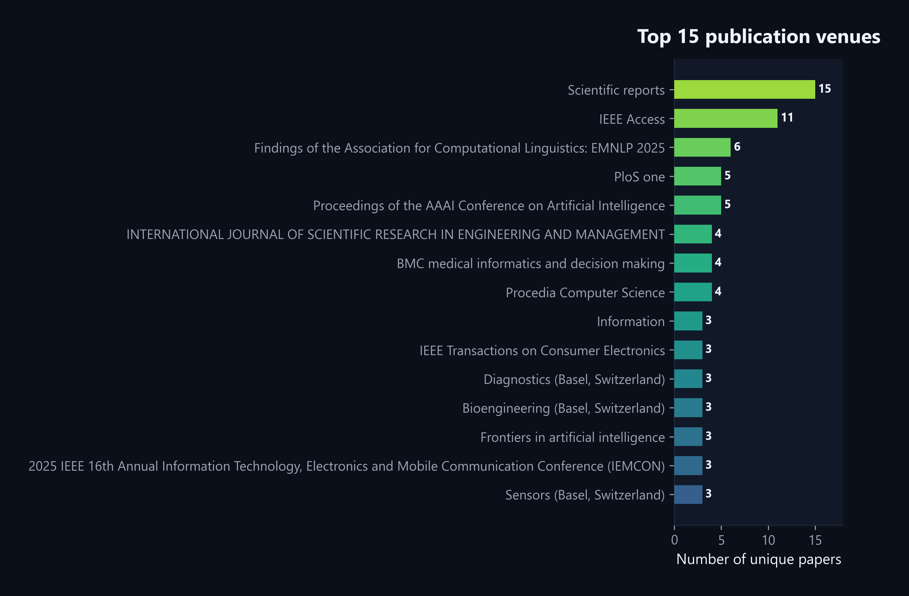
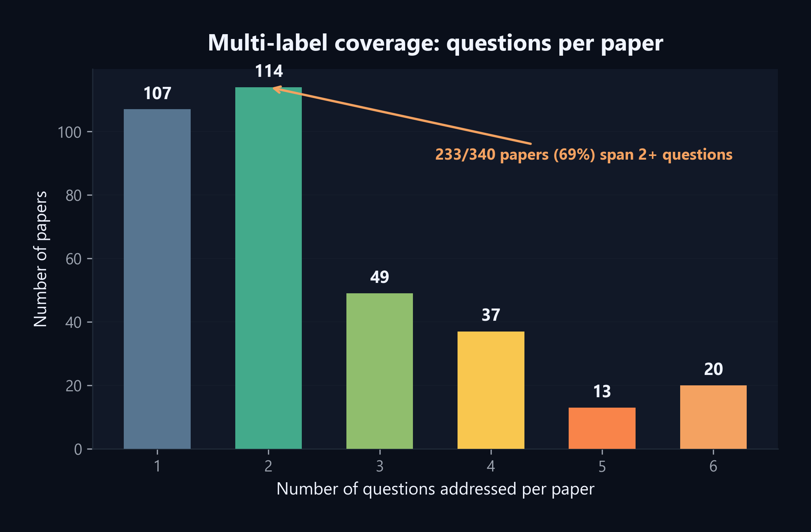
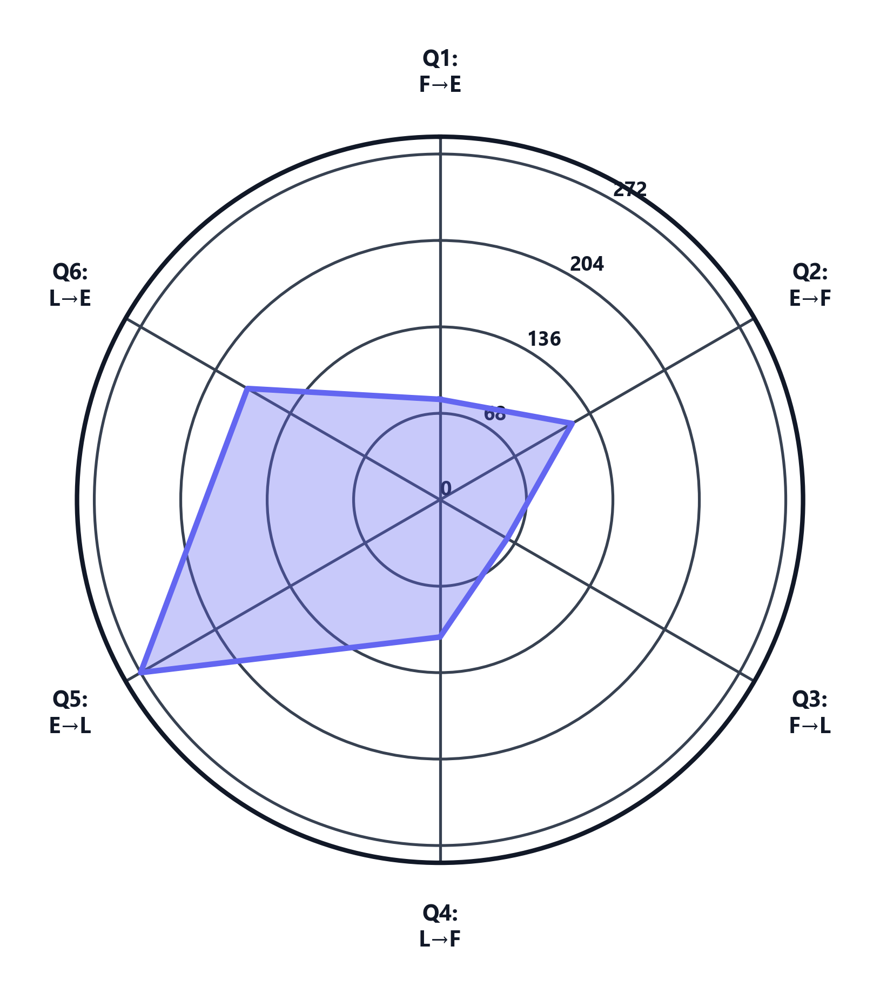
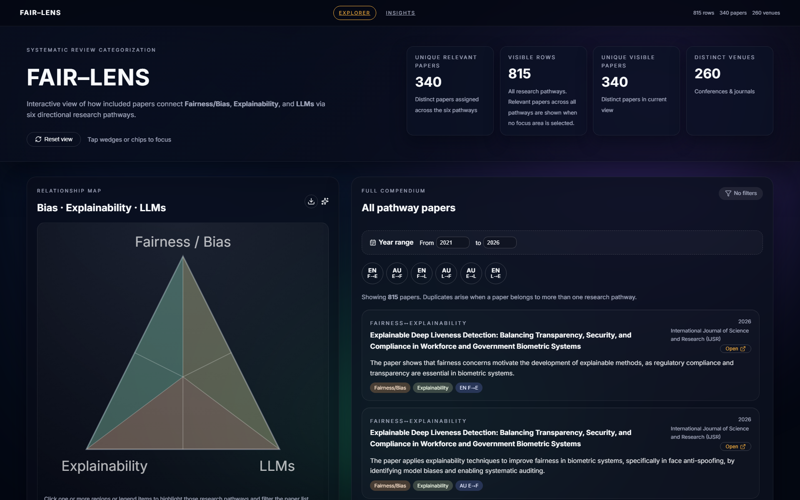
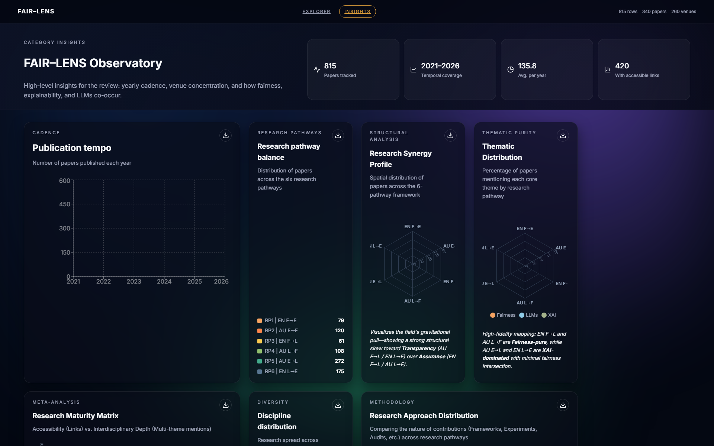

# FAIR-LENS

FAIR-LENS is the analysis workspace behind the accompanying paper on the intersection of fairness, explainability, and large language models. The repository contains the retrieval, screening, directional coding, figure-generation, use-case illustration, and dashboard assets used to build the study.

This codebase is both a research pipeline and an artifact repository: it preserves the intermediate screening files, the final directional assignments, the publication figures, the evidence-table outputs, and the embedded React dashboard used to explore the coded corpus.

## Associated Paper

This repository accompanies the FAIR-LENS manuscript and preserves the analysis outputs, figures, and dashboard assets used in the study. Citation details can be attached here once the publication record is finalized.

## What FAIR-LENS Covers

FAIR-LENS organizes the literature through three pairwise **lenses** and six directional **research pathways**.

| Research pathway | Pathway name | Direction | Lens |
|---|---|---|---|---|
| `RP1 / EN F->E` | Enable Credibility | Fairness -> Explainability | Accountability |
| `RP2 / AU E->F` | Audit Fairness | Explainability -> Fairness | Accountability |
| `RP3 / EN F->L` | Enable Alignment | Fairness -> LLMs | Assurance |
| `RP4 / AU L->F` | Audit Outcomes | LLMs -> Fairness | Assurance |
| `RP5 / AU E->L` | Audit Behavior | Explainability -> LLMs | Transparency |
| `RP6 / EN L->E` | Enable Explanations | LLMs -> Explainability | Transparency |

## Current Snapshot

The checked-in outputs currently reflect the following corpus snapshot:

- `960` candidate records loaded for screening
- `565` records kept after conservative LLM-based prefiltering
- `340` unique relevant papers in the final coded set
- `815` paper-pathway assignments across the six research pathways
- `233` papers spanning two or more research pathways
- `259` unique venues represented in the final relevant set

Per-pathway relevant counts:

- `RP1`: `79`
- `RP2`: `120`
- `RP3`: `61`
- `RP4`: `108`
- `RP5`: `272`
- `RP6`: `175`

## Repository Layout

```text
FAIR-LEARN/
|-- data/
|   |-- raw/                         # raw search/export data
|   `-- lens/stages/                 # staged screening files (S1, S2, S4)
|-- outputs/
|   |-- prefilter_*.csv|md           # conservative prefilter outputs
|   |-- tri_results_*.csv            # directional coding outputs
|   |-- tri_report.md                # pathway counts + examples
|   |-- figures/                     # publication-ready figures (fig1-fig23)
|   |-- fairlens_techniques/         # technique assignments + summaries
|   `-- plots/                       # earlier exploratory plots
|-- fair-lens-visualizer/            # embedded React dashboard
|-- use_case/                        # publication SVG use-case figures
|-- lens.py                          # corpus retrieval + staged filtering
|-- exclude_final.py                 # conservative LLM prefilter (E0-E2)
|-- questions.py                     # six-pathway directional assignment
|-- plot_figures.py                  # main publication figure generator
|-- make_fairlens_evidence_table.py  # evidence table / technique synthesis figure
|-- count_stats.py                   # quick descriptive counts
`-- scripts/                         # thin wrappers for selected root scripts
```

## End-to-End Workflow

### 1. Retrieve and stage the corpus

`lens.py` handles the broad FAIR-LENS search, staging, and early bookkeeping. It supports either:

- direct Lens API access via `LENS_API_TOKEN`, or
- CSV imports placed under `data/lens/exports/`

Relevant staged files already present in the repo include:

- `data/lens/stages/S1_year.csv`
- `data/lens/stages/S2_blockfilter.csv`
- `data/lens/stages/S4_tagged.csv`

### 2. Run the conservative prefilter

`exclude_final.py` applies the final content-based exclusion pass using three conservative rules:

- `E0`: not actually about transformer LLMs
- `E1`: no substantive fairness/bias and no substantive explainability/XAI
- `E2`: commentary-only for this review scope

Outputs:

- `outputs/prefilter_kept.csv`
- `outputs/prefilter_dropped.csv`
- `outputs/prefilter_report.md`

### 3. Assign directional research pathways

`questions.py` scores each retained paper against the six FAIR-LENS pathways and writes:

- `outputs/tri_results_master.csv`
- six pathway-specific result CSVs
- `outputs/tri_report.md`

This is the main coded dataset used downstream by the figures and the dashboard.

### 4. Generate publication figures

`plot_figures.py` produces the main figure set in `outputs/figures/`, including:

- pathway distributions
- publication cadence
- lens and pathway balance
- radar summaries
- thematic and taxonomy views
- relationship triangle views

### 5. Generate the evidence table and technique summaries

The repo already includes precomputed technique outputs under `outputs/fairlens_techniques/`:

- `technique_assignments_clean.csv`
- `technique_assignments_raw.jsonl`
- `technique_summary_by_goal.csv`
- `technique_summary_by_axis.csv`

Those feed the evidence-table figure built by `make_fairlens_evidence_table.py`, whose outputs include:

- `outputs/figures/fairlens_evidence_table_enriched.png`
- `outputs/figures/fairlens_evidence_table_enriched.pdf`
- `outputs/figures/fairlens_evidence_table_enriched_selected_techniques.md`

### 6. Explore the corpus in the dashboard

The React dashboard lives in `fair-lens-visualizer/`. It reads:

- `fair-lens-visualizer/public/fairlens_papers.json`
- `fair-lens-visualizer/public/dashboard_insights.json`

If you refresh `outputs/tri_results_master.csv`, regenerate the paper JSON with:

```powershell
cd fair-lens-visualizer
..\python.cmd prepare_fairlens_json.py
```

## Reproducing the Main Steps

On this Windows setup, commands can be run with `.\python.cmd`. If your own Python is on `PATH`, plain `python` also works.

### Environment variables

Set the variables you need before running the LLM-backed steps:

```powershell
$env:LENS_API_TOKEN = "your_lens_api_token"
$env:OPENWEBUI_API_KEY = "your_openwebui_api_key"
$env:OPENWEBUI_BASE_URL = "https://filos.csd.auth.gr"
```

### Analysis pipeline

```powershell
.\python.cmd lens.py
.\python.cmd exclude_final.py
.\python.cmd questions.py
.\python.cmd plot_figures.py
.\python.cmd make_fairlens_evidence_table.py --summary outputs/fairlens_techniques/technique_summary_by_goal.csv --output outputs/figures/fairlens_evidence_table_enriched --top_k 20
```

### Dashboard

```powershell
cd fair-lens-visualizer
npm install
npm run dev
```

## Important Output Artifacts

If you only need the publication-facing artifacts, start here:

- `outputs/tri_report.md` - high-level pathway counts and examples
- `outputs/figures/` - final figure set used in the manuscript
- `outputs/fairlens_evidence_table.md` - paper-level evidence table
- `outputs/figures/fairlens_evidence_table_enriched.png` - enriched evidence summary
- `use_case/fair_lens_usecase.svg` - primary use-case figure
- `use_case/fair_lens_usecase_hiring.svg` - hiring-support use-case variant

## Selected Figures

The repository already includes the main exported figure set under `outputs/figures/`. The following are especially useful for a quick repository preview and paper companion page.

### Publication cadence



Suggested caption: "Temporal growth of the FAIR-LENS literature across the review window."

### Lens distribution



Suggested caption: "Distribution of the coded literature across the three FAIR-LENS lenses."

### Top venues



Suggested caption: "Most frequent venues and publication outlets in the final FAIR-LENS corpus."

### Multilabel pathway coverage



Suggested caption: "Number of research pathways covered per paper in the final corpus."

### Synergy radar



Suggested caption: "Relative balance of pathway coverage across the FAIR-LENS research pathways."

## Supplementary Assets

### Framework diagram

[Framework figure (PDF)](docs/paper/framework.pdf)

Conceptual overview of the FAIR-LENS lenses and directional research pathways.

### Dashboard overview



Explorer view of the FAIR-LENS dashboard, showing the relationship map, pathway filters, and coded paper list.

### Dashboard insights



Insights view of the FAIR-LENS dashboard, highlighting cadence, pathway balance, structural profile, thematic distribution, and related analytics.

## Notes

- The repository includes checked-in outputs so the paper figures and dashboard can be inspected without rerunning the full pipeline.
